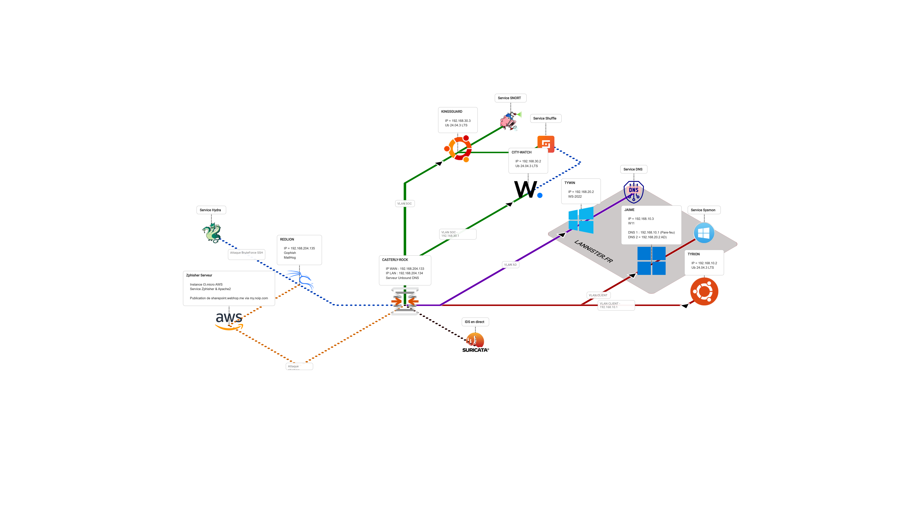
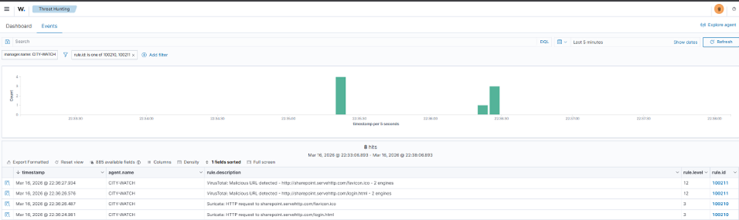

# SOC Lab — Scénario 3 : Détection & Blocage d’une url complète de phishing

## Architecture



```
JAIME (192.168.10.3)          VM cliente Windows — navigateur Edge
        │
        │ HTTP/HTTPS
        ▼
CASTERLY-ROCK (192.168.30.1)  OPNsense — Suricata sur em3 (VLAN_CLIENT)
        │
        │ syslog UDP 514
        ▼
CITY-WATCH (192.168.30.2)     Wazuh Manager
        │
        ├──→ VirusTotal API v3 (vérification URL)
        │
        ├──→ Shuffle webhook (orchestration)
        │         │
        │         ▼
        │    CASTERLY-ROCK API OPNsense
        │         │
        │         ▼
        │    Unbound DNS Override → 0.0.0.0 (sinkhole)
        │
        └──→ Dashboard Wazuh (alertes 100210/100211/100212)
```

## Pipeline de détection

```
1. JAIME navigue sur http://site-malveillant.com
2. Suricata capture le trafic HTTP/TLS sur em3
3. eve-log type:syslog envoie l'event JSON à Wazuh (UDP 514)
4. Décodeur custom "suricata" extrait le JSON du message syslog
5. Règle 100210 (HTTP) ou 100212 (TLS) se déclenche (level 3)
6. Intégration custom-virustotal-url.py vérifie l'URL sur VirusTotal
7. Si malveillant → alerte ré-injectée via socket Unix Wazuh
8. Règle 100211 se déclenche (level 12)
9. Intégration Shuffle reçoit le webhook
10. Shuffle appelle l'API OPNsense → DNS sinkhole (domaine → 0.0.0.0)
11. Toute résolution DNS future du domaine est bloquée
```

---

## Fichiers déployés

### CASTERLY-ROCK (OPNsense)

### `/usr/local/etc/suricata/suricata.yaml` — Bloc syslog eve-log (lignes ~320-343)

```yaml
-eve-log:
enabled:yes
type: syslog
identity:"suricata"
facility: local5
level: Info
community-id:true
community-id-seed:0
xff:
enabled:yes
mode: extra-data
deployment: reverse
header: X-Forwarded-For
types:
-alert:
metadata:yes
tagged-packets:yes
-http:
extended:yes
-dns:
enabled:yes
-tls:
extended:yes
```

> **ATTENTION** : OPNsense peut écraser ce fichier lors d’un redémarrage via l’interface web.
Si Suricata est redémarré depuis l’UI OPNsense, vérifier que le bloc `http/dns/tls` est toujours présent.
Script de re-patch : `deploy/patch_suricata.py`
> 

---

### CITY-WATCH (Wazuh)

### `/var/ossec/etc/decoders/suricata-decoder.xml`

Décode les events Suricata JSON reçus via syslog. Le pré-décodeur syslog extrait `program_name: suricata`, puis le `JSON_Decoder` parse le JSON.

```xml
<!-- Custom decoder for Suricata EVE JSON via syslog -->
<decoder name="suricata">
  <program_name>suricata</program_name>
</decoder>

<decoder name="suricata-json">
  <parent>suricata</parent>
  <plugin_decoder>JSON_Decoder</plugin_decoder>
</decoder>
```

### `/var/ossec/etc/rules/100-suricata-http-rules.xml`

Trois règles custom :

| Règle | Level | Déclencheur | Description |
| --- | --- | --- | --- |
| 100210 | 3 | Event Suricata `event_type: http` | Requête HTTP capturée |
| 100212 | 3 | Event Suricata `event_type: tls` | Connexion HTTPS (SNI) capturée |
| 100211 | 12 | Retour VT avec `positives > 0` | URL malveillante confirmée |

### `/var/ossec/integrations/custom-virustotal-url.py`

Script Python appelé par `wazuh-integratord` quand les règles 100210 ou 100212 se déclenchent.

**Fonctionnalités :**

- Extrait le hostname depuis les events HTTP (`http.hostname`) ou TLS (`tls.sni`)
- **Whitelist** : ignore les domaines connus (Microsoft, Google, Cloudflare, Digicert, etc.)
- **Cache** : stocke les résultats VT pendant 1h dans `/var/ossec/logs/vt-url-cache.json` pour éviter les appels redondants
- Vérifie l’URL sur VirusTotal API v3 (`/urls/{url_id}`)
- Si l’URL n’est pas dans la base VT, la soumet pour analyse
- Gère le rate limiting (429) gracieusement
- Envoie le résultat via le **socket Unix Wazuh** (`/var/ossec/queue/sockets/queue`)

**Shebang** : `#!/var/ossec/framework/python/bin/python3` (Python embarqué Wazuh)

**Permissions** : `750 root:wazuh`

**Fichier cache** : `/var/ossec/logs/vt-url-cache.json` (TTL 1h)

**Debug** : créer `/var/ossec/logs/integrations-debug` pour activer les logs dans `/var/ossec/logs/integrations.log`

### `/var/ossec/integrations/custom-virustotal-url` (wrapper shell)

```bash
#!/bin/sh
SCRIPT_DIR="$(cd "$(dirname "$0")" && pwd)"
exec /usr/bin/python3 "${SCRIPT_DIR}/custom-virustotal-url.py" "$@"
```

**Permissions** : `750 root:wazuh`

### Blocs d’intégration dans `/var/ossec/etc/ossec.conf`

```xml
<!-- Intégration VirusTotal pour URLs HTTP et TLS -->
<integration>
  <name>custom-virustotal-url</name>
  <api_key>c244414459574081ff3f6a2c54dc323d90bf00fca2f26d261ed3d3310e521d6f</api_key>
  <rule_id>100210,100212</rule_id>
  <alert_format>json</alert_format>
</integration>

<!-- Shuffle — blocage DNS sur alerte VT malveillante -->
<integration>
  <name>shuffle</name>
  <hook_url>http://192.168.30.3:3001/api/v1/hooks/webhook_df887897-8626-59ef-b414-2a6b085d77c5</hook_url>
  <rule_id>100211</rule_id>
  <alert_format>json</alert_format>
</integration>
```

---

### KINGSGUARD (Shuffle)

### Workflow : Block URL VirusTotal

**Déclencheur** : Webhook Wazuh sur règle 100211

**Action** : POST vers l’API OPNsense Unbound

**Étape 1** — Ajouter le DNS override (sinkhole) :

```
Method : POST
URL    : https://192.168.204.134/api/unbound/settings/addHostOverrid
Auth   : Basic (API Key / Secret OPNsense)
Headers: Content-Type: application/json
Body   :
```

```json
{
  "host": {
    "enabled": "1",
    "hostname": "*",
    "domain": "$exec.all_fields.data.virustotal.source.file",
    "server": "0.0.0.0",
    "description": "Wazuh/VT - $exec.all_fields.timestamp"
  }
}
```

**Étape 2** — Appliquer la configuration Unbound :

```
Method : POST
URL    : https://192.168.204.134/api/unbound/service/reconfigure
Auth   : Basic (API Key / Secret OPNsense)
Body   : (vide / empty)
```

**Résultat** : Le domaine malveillant est résolu en `0.0.0.0` — plus aucun client ne peut y accéder.

**Vérification** : OPNsense → Services → Unbound DNS → Overrides




---

## Whitelist des domaines (pas de vérification VT)

Les domaines suivants ne consomment pas de jetons VT :

| Catégorie | Domaines |
| --- | --- |
| Microsoft | `microsoft.com`, `windowsupdate.com`, `windows.com`, `windows.net`, `office.com`, `office365.com`, `live.com`, `bing.com`, `msn.com`, `outlook.com`, `skype.com`, `azure.com`, `azureedge.net`, `azurefd.net`, `gfx.ms`, `sfx.ms`, `msftstatic.com`, `msftauth.net`, `msauth.net`, `onedrive.com`, `msedge.net`, `msftconnecttest.com` |
| Google | `google.com`, `googleapis.com`, `gstatic.com`, `youtube.com` |
| Apple | `apple.com`, `icloud.com` |
| Certificats | `digicert.com`, `verisign.com`, `letsencrypt.org`, `globalsign.com`, `symantec.com`, `sectigo.com`, `usertrust.com`, `comodoca.com` |
| CDN | `cloudflare.com`, `cloudflare-dns.com`, `akamai.com`, `akamaized.net`, `akadns.net`, `amazonaws.com`, `cloudfront.net` |
| Autres | `facebook.com`, `fbcdn.net`, `mozilla.org`, `mozilla.com`, `nelreports.net`, `trafficmanager.net` |

Pour ajouter un domaine à la whitelist, éditer `WHITELIST_DOMAINS` dans `/var/ossec/integrations/custom-virustotal-url.py` puis `sudo systemctl restart wazuh-manager`.

---

## Problèmes rencontrés

| Symptôme | Cause probable | Solution |
| --- | --- | --- |
| Pas de 100210/100212 dans les alertes | `suricata.yaml` écrasé par OPNsense (bloc http/dns/tls manquant) | Re-patcher avec `deploy/patch_suricata.py` + `sudo service suricata restart` |
| 100210 arrive mais pas de résultat VT | Rate limiting VT (429) | Attendre 1-2 min, vérifier `/var/ossec/logs/integrations.log` |
| VT retourne `malicious=0` pour un site suspect | VT n’a pas encore analysé cette URL | Le script soumet automatiquement l’URL ; réessayer après quelques minutes |
| 100211 ne se déclenche pas | Le script VT n’envoie pas via le socket | Vérifier que le script utilise `send_msg()` avec `socket(AF_UNIX)`, pas `print()` |
| Trop d’appels VT, quota épuisé | Domaines non whitelistés génèrent des appels | Ajouter les domaines fréquents dans `WHITELIST_DOMAINS` |
| Shuffle ne bloque pas | Mauvais chemin de variable dans le body | Utiliser `$exec.all_fields.data.virustotal.source.file` pour le domaine |
| DNS sinkhole pas appliqué | `reconfigure` non appelé | Ajouter un 2e noeud POST vers `/api/unbound/service/reconfigure` |

## Commandes utiles

```bash
# Vérifier les alertes Suricata HTTP/TLS
sudo grep '100210\|100212' /var/ossec/logs/alerts/alerts.json | tail -5

# Vérifier les alertes VT malveillantes
sudo grep '"id":"100211"' /var/ossec/logs/alerts/alerts.json | tail -5

# Voir les logs d'intégration VT (SKIP, CACHE, résultats)
sudo strings /var/ossec/logs/integrations.log | grep 'custom-virustotal-url' | tail -20

# Vérifier que le décodeur fonctionne
sudo /var/ossec/bin/wazuh-logtest
# Coller un event syslog Suricata et vérifier Phase 2 (decoder: suricata) + Phase 3 (rule: 100210)

# Vérifier les overrides DNS sur OPNsense
curl -k -u 'KEY:SECRET' https://127.0.0.1/api/unbound/settings/searchHostOverride -s | python3 -m json.tool

# Re-patcher suricata.yaml si OPNsense l'a écrasé
python deploy/patch_suricata.py  # depuis le poste de gestion
sudo service suricata restart    # sur CASTERLY-ROCK

# Vider le cache VT (force re-vérification)
sudo rm /var/ossec/logs/vt-url-cache.json && sudo systemctl restart wazuh-manager
```

---